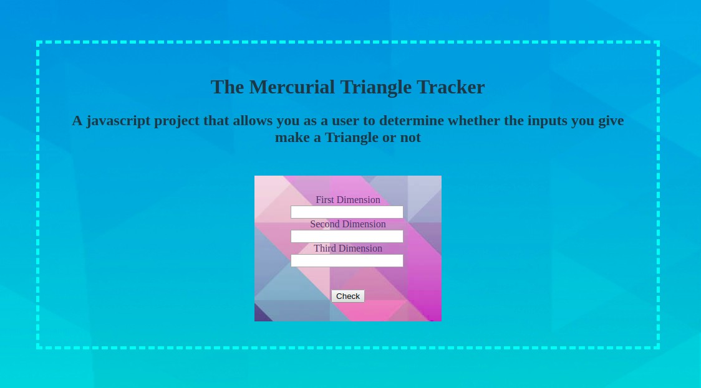

# Project Title

The Mercurial Triangle Tracker
##

This project enables a user to input three (or less) sample dimensions in a form to check whether the dimensions logically make a triangle. The project performs the following checks and gives the following feedback:
* If the dimensions are equal, it alerts the user that they could make an equilateral triangle.
* If two dimensions are equal, it alerts the user that they could make an isosceles triangle.
* If no dimensions are equal, it alerts the user that they could make an scalene triangle.
* If any of the dimensions are not integers, it alerts the user that they could not make a triangle.
* If any of the dimensions are equal to zero(0), it alerts the user that they could not make a triangle.

## Deployment

To deploy the program, stage it on Git and push it to GitHub. Then, create a gh-pages branch from your master branch in the local machine. Thereafter, push the project to gh-pages on GitHub. After that, the program will be ready for Deployment on Git Hub Pages

The live page can be found in the following link: 

* After Deployment, the following image shows what the expected output would be.

## Built With

* Atom - The text editor used
* Git - The version control environment Used

## Contributing

Any contributions to this projects will be greatly appreciated. If you want to contribute to it, here are the suggested instructions:
* Clone this GitHub repository to your local machine.
* Make your contributions.
* Email me the zipped project at munenecyp@gmail.com , or
* Request permissions to post your contribution at my GitHub repository through the same email address.

Alternatively, you could email the main developer at munenecyp@gmail.com with ideas on how this project could be more effective, efficient or beneficial.

## Versioning
Used GIT and GitHub. There are commits attached to the entire project to show the management of versions.

## Authors

* Cyprian Munene, any other contributor after the completion of the work can be viewed at this GitHub repository
## License

This project is licensed under the MIT License. Moringa School moreover retains certain rights to elements in the code of this program.

## Acknowledgments

* Hat tip to anyone whose code was used
* Inspiration
* MORINGA TMs
